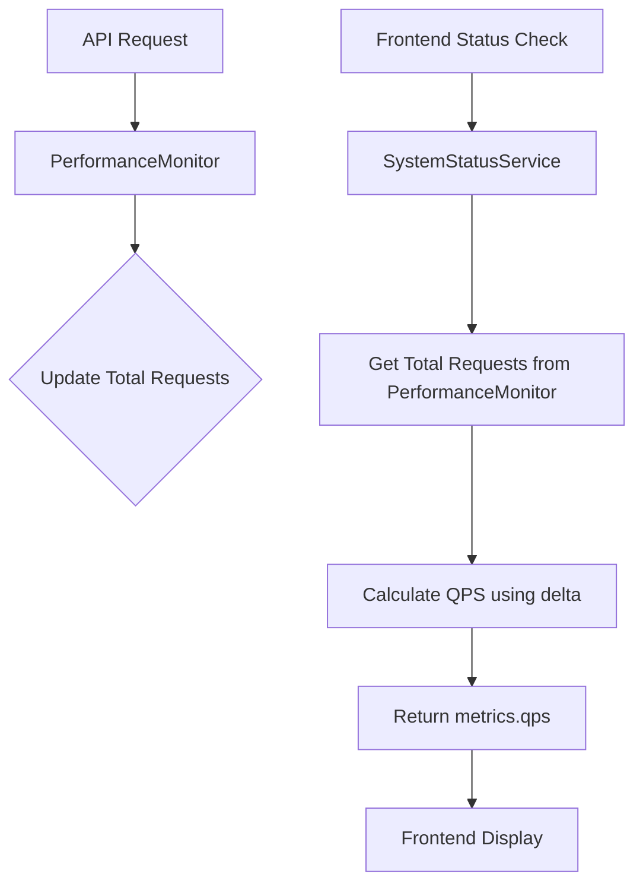

# DESIGN: 后端 QPS 计算方案

## 1. 整体架构
本设计旨在通过对请求增量的监控，在 `SystemStatusService` 中实现实时 QPS 计算。

## 2. 核心组件
- **SystemStatusService**: 负责状态评估的核心服务，维护计算 QPS 所需的历史状态。
- **PerformanceMonitor**: 性能监控中间件，提供全局累计请求数。

## 3. 数据流向图


## 4. 关键算法逻辑
### QPS 计算公式
```
ΔRequests = CurrentTotalRequests - LastTotalRequests
ΔTime = CurrentTime - LastCheckTime (in seconds)
QPS = ΔRequests / ΔTime
```

### 状态维护
在 `SystemStatusService` 实例中增加以下私有属性：
- `this.lastBackendCheckTime`: 上次检查的时间戳。
- `this.lastBackendTotalRequests`: 上次检查时的总请求数。

## 5. 接口契约定义
### 修改后的 evaluateBackendStatus 返回结构
```json
{
  "success": true,
  "metrics": {
    "apiResponseTime": 15,
    "qps": 2.5,
    "uptime": 3600,
    ...
  }
}
```

## 6. 异常处理策略
- **首次调用**：`lastBackendCheckTime` 为空时，QPS 设为 0。
- **时间间隔过短**：若 `ΔTime < 0.1s`，跳过计算以防止除以零或数值抖动。
- **请求数重置**：若 `ΔRequests < 0`（如服务重启），则将 `lastBackendTotalRequests` 重置为当前值，本次 QPS 设为 0。
