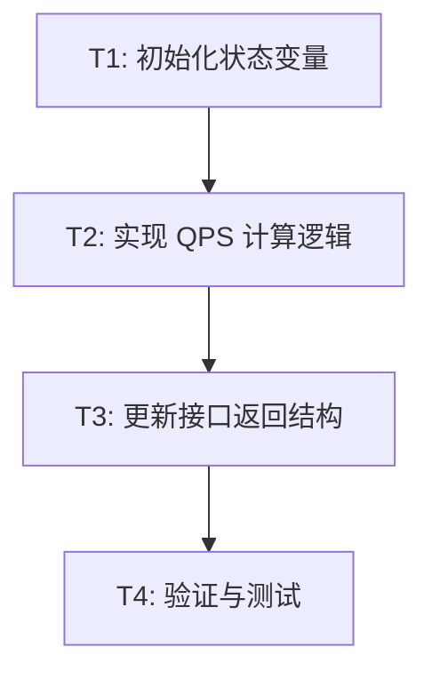

# TASK: 后端 QPS 修复原子任务拆分

## 任务依赖图

## 原子任务列表

### T1: 初始化状态变量
- **说明**：在 `SystemStatusService` 构造函数中初始化用于计算 QPS 的变量。
- **输入**：`AI-server/services/systemStatusService.js`
- **输出**：在 `constructor` 中新增 `this.lastBackendCheckTime` 和 `this.lastBackendTotalRequests`。
- **验收标准**：代码中包含初始化的变量，默认为 `null` 或 `0`。

### T2: 实现 QPS 计算逻辑
- **说明**：在 `evaluateBackendStatus` 方法开始处或合适位置编写 QPS 计算算法。
- **输入**：`performanceMonitor.getStats()` 提供的总请求数。
- **输出**：计算出的 `qps` 数值。
- **验收标准**：处理好首次运行、时间增量、请求数重置等边缘情况。

### T3: 更新接口返回结构
- **说明**：将计算出的 `qps` 放入返回给前端的 `metrics` 对象中。
- **输入**：T2 计算出的 `qps`。
- **输出**：`evaluateBackendStatus` 的返回对象中包含 `metrics.qps`。
- **验收标准**：接口返回的数据结构符合前端 `Home.vue` 的预期。

### T4: 验证与测试
- **说明**：通过多次调用接口并模拟请求，验证 QPS 是否动态变化。
- **输入**：`/status/backend` 接口。
- **输出**：测试报告。
- **验收标准**：至少执行 3 次 API 调用，QPS 显示正常，且不引入新的错误。
