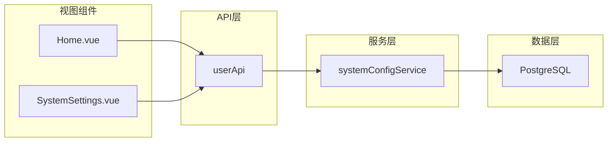
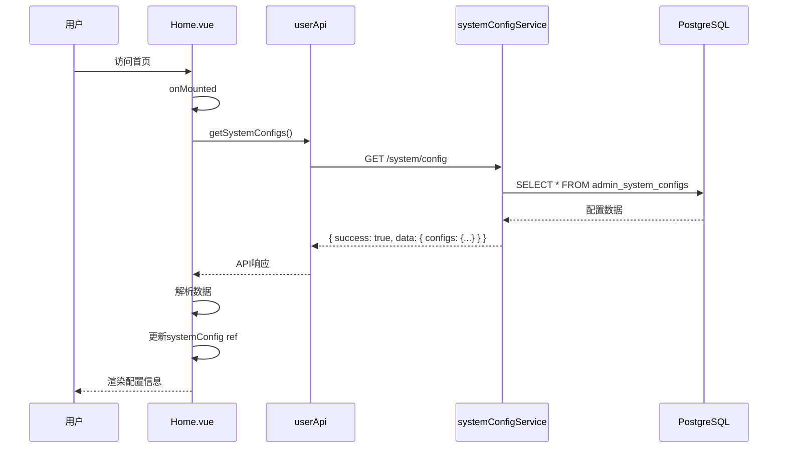
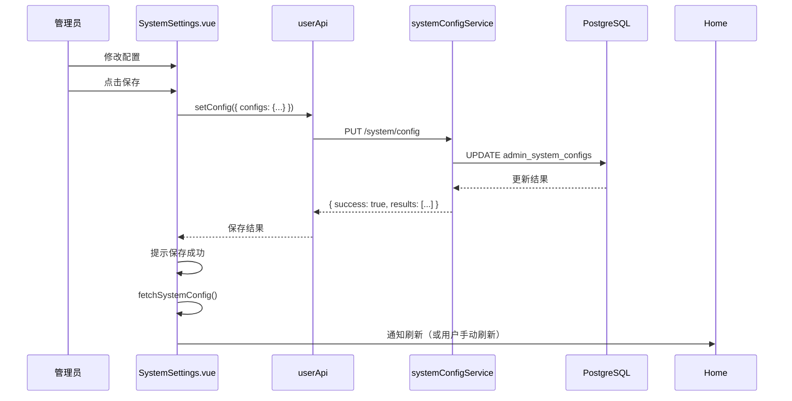

# DESIGN_SYSTEM_CONFIG_SYNC

## 整体架构设计

### 系统分层架构图

```mermaid
graph TB
    subgraph "前端展示层 AI-admin"
        A1[Home.vue]
        A2[SystemSettings.vue]
    end

    subgraph "API接口层"
        B1[/system/config]
        B2[/system/config/groups]
    end

    subgraph "服务层"
        C1[systemConfigService.js]
        C2[configCache]
    end

    subgraph "数据访问层"
        D1[database.js]
        D2[admin_system_configs表]
    end

    A1 --> B1
    A2 --> B1
    B1 --> C1
    B2 --> C1
    C1 --> D1
    C1 --> C2
    D1 --> D2
```

### 模块依赖关系图



---

## 分层设计和核心组件

### 1. 前端组件层

| 组件名称 | 职责 | 依赖 |
|---------|------|------|
| Home.vue | 展示系统配置信息和系统状态概览 | userApi、systemConfig、systemInfo |
| SystemSettings.vue | 展示和编辑系统配置信息 | userApi、configForm |

### 2. API接口层

| 接口路径 | 方法 | 功能 | 请求参数 |
|---------|------|------|---------|
| `/system/config` | GET | 获取所有系统配置 | environment、group、active |
| `/system/config` | PUT | 批量更新配置 | { configs: {...} } |
| `/system/config/groups` | GET | 获取配置分组列表 | 无 |

### 3. 服务层

| 服务名称 | 职责 | 核心方法 |
|---------|------|---------|
| systemConfigService | 系统配置CRUD操作和缓存管理 | getAllConfigs、setConfigs、getCache、setCache |

### 4. 数据层

| 数据存储 | 职责 | 结构 |
|---------|------|------|
| admin_system_configs表 | 存储系统配置 | config_key、config_value、data_type、config_group |

---

## 接口契约定义

### 前端API接口

```typescript
// userApi 接口定义
export const userApi = {
  // 获取所有系统配置
  getSystemConfigs: (params?: {
    environment?: string;
    group?: string;
    active?: boolean;
  }) => api.get('/system/config', { params }),

  // 批量设置配置
  setConfig: (data: { configs: Record<string, any> }) =>
    api.put('/system/config', data),

  // 获取配置分组
  getConfigGroups: () => api.get('/system/config/groups'),
};
```

### 后端接口响应格式

```json
{
  "success": true,
  "data": {
    "configs": {
      "system.name": {
        "value": "AI记账管理系统",
        "displayName": "系统名称",
        "description": "系统的显示名称"
      },
      "system.version": {
        "value": "2.1.0",
        "displayName": "系统版本",
        "description": "当前系统版本号"
      }
    },
    "meta": {
      "environment": "all",
      "group": "all",
      "count": 20
    }
  }
}
```

### 前端数据模型

```typescript
// 系统配置数据模型
interface SystemConfig {
  name: string;              // system.name
  version: string;           // system.version
  environment: string;       // system.environment
  deployTime: string;        // system.deploy_time
  serverAddress: string;     // server.host
  port: number;              // server.port
  dbAddress: string;         // database.host
  cacheServer: string;       // cache.server
  logLevel: string;          // log.level
  maxConnections: number;    // server.max_connections
  timeout: number;           // session.timeout
  backupPolicy: string;      // backup.schedule
}

// 系统状态数据模型
interface SystemInfo {
  version: string;       // 版本号
  uptime: string;        // 运行时长
  environment: string;   // 部署环境
  startTime: string;     // 启动时间
}
```

---

## 数据流向图

### 读取配置数据流



### 修改配置数据流



---

## 异常处理策略

### 1. API调用异常

```javascript
try {
  const response = await userApi.getSystemConfigs();
  // 数据解析
} catch (error) {
  console.error('❌ 获取系统配置失败:', error);
  ElMessage.error('获取系统配置失败: ' + (error as Error).message);
  // 使用默认值
  systemConfig.value.name = 'AI记账管理系统';
  systemConfig.value.version = '2.1.0';
}
```

### 2. 数据解析异常

```javascript
// 防御性数据解析
let data = response;
if (response && response.success === true && response.data) {
  data = response.data;
}

if (data && data.configs) {
  const configs = data.configs;
  systemConfig.value.name = configs['system.name']?.value || '';
  systemConfig.value.version = configs['system.version']?.value || '';
} else {
  console.warn('⚠️ API返回数据中没有configs字段:', data);
}
```

### 3. 配置保存异常

```javascript
try {
  await saveConfig();
  ElMessage.success('配置保存成功');
} catch (error) {
  console.error('❌ 保存配置失败:', error);
  ElMessage.error('保存配置失败: ' + (error as Error).message);
}
```

### 4. 缓存失效处理

```javascript
// systemConfigService.js 中的缓存失效逻辑
function invalidateCache(key) {
  configCache.delete(key);
  configCache.clear(); // 确保所有缓存被清除
}
```

---

## 配置映射规则详细说明

### Home.vue 数据映射

| 模板变量 | 数据来源 | 配置键 | 解析方式 |
|---------|---------|-------|---------|
| `systemConfig.name` | API configs | `system.name` | `configs['system.name']?.value` |
| `systemConfig.version` | API configs | `system.version` | `configs['system.version']?.value` |
| `systemConfig.environment` | API configs | `system.environment` | `configs['system.environment']?.value` |
| `systemConfig.deployTime` | API configs | `system.deploy_time` | `configs['system.deploy_time']?.value` |
| `systemInfo.version` | API configs | `system.version` | `configs['system.version']?.value` |
| `systemInfo.environment` | API configs | `system.environment` | `configs['system.environment']?.value` |

### SystemSettings.vue 数据映射

| 模板变量 | 数据来源 | 配置键 | 解析方式 |
|---------|---------|-------|---------|
| `systemInfo.name` | API configs | `system.name` | `configs['system.name']?.value` |
| `systemInfo.version` | API configs | `system.version` | `configs['system.version']?.value` |

---

## 关键实现步骤

### 步骤一：完善 Home.vue 数据解析

```javascript
// 1. 确保 fetchSystemConfig 正确解析API响应
const fetchSystemConfig = async () => {
  try {
    configLoading.value = true;
    const response = await userApi.getSystemConfigs();
    console.log('📡 API响应原始数据:', response);

    // 正确处理双层嵌套结构
    let data = response;
    if (response && response.success === true && response.data) {
      data = response.data;
    }

    if (data && data.configs) {
      const configs = data.configs;
      // 使用配置值更新 systemConfig
      systemConfig.value.name = configs['system.name']?.value || '';
      systemConfig.value.version = configs['system.version']?.value || '';
      systemConfig.value.environment = configs['system.environment']?.value || '';
      // ... 其他配置项

      // 同步更新 systemInfo
      systemInfo.value.version = configs['system.version']?.value || '';
      systemInfo.value.environment = configs['system.environment']?.value || '';
    }
  } catch (error) {
    console.error('❌ 获取系统配置失败:', error);
  } finally {
    configLoading.value = false;
  }
};
```

### 步骤二：添加配置同步函数

```javascript
// 从 systemConfig 同步到 systemInfo
const syncSystemInfoFromConfig = () => {
  systemInfo.value.version = systemConfig.value.version;
  systemInfo.value.environment = systemConfig.value.environment;
};

// 在 fetchSystemConfig 完成后调用
const fetchSystemConfig = async () => {
  // ... 获取配置逻辑
  if (data && data.configs) {
    // ... 更新 systemConfig
    // 同步更新 systemInfo
    syncSystemInfoFromConfig();
  }
};
```

### 步骤三：修改 SystemSettings.vue

```javascript
// 确保 systemInfo 从API获取
onMounted(async () => {
  await fetchSystemConfig();
  // 将配置数据同步到 systemInfo
  systemInfo.value.name = systemConfig.value.name;
  systemInfo.value.version = systemConfig.value.version;
});
```

---

## 质量门控检查清单

- [ ] 架构图清晰准确，所有组件关系正确
- [ ] 接口定义完整，包含请求参数和响应格式
- [ ] 与现有系统无冲突，使用现有API接口
- [ ] 设计可行性已验证，有完整的异常处理策略
- [ ] 数据映射规则详细明确
- [ ] 代码实现步骤清晰可执行
