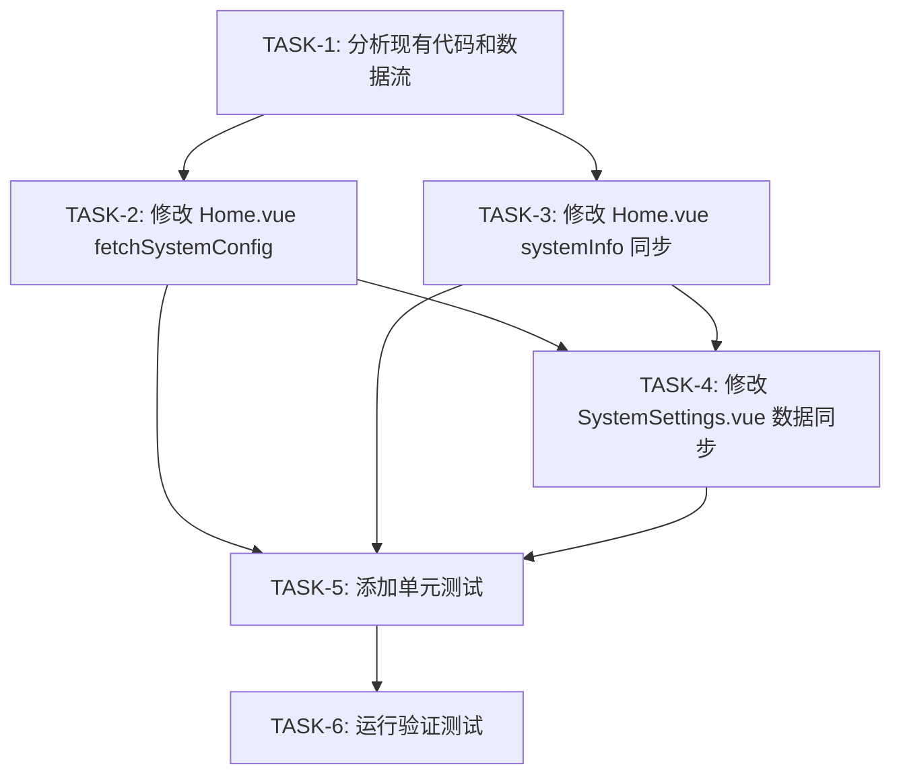

# TASK_SYSTEM_CONFIG_SYNC

## 任务依赖关系图



---

## 原子任务列表

### TASK-1: 分析现有代码和数据流

**输入契约**

| 类型 | 描述 |
|-----|------|
| 前置依赖 | 无 |
| 输入数据 | 现有 Home.vue、SystemSettings.vue 代码 |
| 环境依赖 | VS Code 或任意代码编辑器 |

**输出契约**

| 类型 | 描述 |
|-----|------|
| 输出数据 | 代码分析报告（内部文档） |
| 交付物 | 标识需要修改的关键代码位置 |
| 验收标准 | 1. 确认 fetchSystemConfig 函数位置<br>2. 确认 systemConfig 和 systemInfo 数据来源<br>3. 确认 API 调用链路 |

**实现约束**

| 类型 | 描述 |
|-----|------|
| 技术栈 | 纯代码审查，不涉及代码修改 |
| 接口规范 | 不涉及 |
| 质量要求 | 代码位置标注准确 |

**依赖关系**

| 关系类型 | 任务 |
|---------|------|
| 后置任务 | TASK-2, TASK-3, TASK-4 |
| 并行任务 | 无 |

---

### TASK-2: 修改 Home.vue fetchSystemConfig 函数

**输入契约**

| 类型 | 描述 |
|-----|------|
| 前置依赖 | TASK-1 完成 |
| 输入数据 | Home.vue 文件（当前版本） |
| 环境依赖 | VS Code、Node.js 环境 |

**输出契约**

| 类型 | 描述 |
|-----|------|
| 输出数据 | 修改后的 Home.vue 文件 |
| 交付物 | 1. fetchSystemConfig 函数完善<br>2. 添加同步函数 syncSystemInfoFromConfig |
| 验收标准 | 1. 函数正确解析双层嵌套响应<br>2. systemConfig 从 API 获取完整数据<br>3. systemInfo 自动同步<br>4. 关键位置有日志输出 |

**实现约束**

| 类型 | 描述 |
|-----|------|
| 技术栈 | Vue 3 + TypeScript + Element Plus |
| 接口规范 | 使用 userApi.getSystemConfigs() |
| 质量要求 | 1. 遵循 Rule 5 处理双层嵌套<br>2. 关键位置打印日志<br>3. 错误处理完善 |

**实现步骤**

```
步骤 1: 打开 Home.vue 文件
步骤 2: 定位 fetchSystemConfig 函数（约1339行）
步骤 3: 修改数据解析逻辑
        - 正确处理 response.success === true
        - 从 response.data 获取 configs
步骤 4: 添加 syncSystemInfoFromConfig 函数
步骤 5: 在 fetchSystemConfig 完成后调用同步函数
步骤 6: 添加调试日志
```

**核心代码示例**

```typescript
const fetchSystemConfig = async () => {
  try {
    configLoading.value = true
    console.log('🔄 开始获取系统配置...')
    
    const response = await userApi.getSystemConfigs()
    console.log('📡 API响应原始数据:', response)
    
    // 标准化数据解析：支持 {success, data: {configs}} 和 {configs} 两种结构
    let data = response
    if (response && response.success === true && response.data) {
      data = response.data
    }
    
    console.log('📊 解析后的数据:', data)
    
    if (data && data.configs) {
      const configs = data.configs
      console.log('📋 配置项数量:', Object.keys(configs).length)

      // 辅助函数：兼容两种键格式（点号分隔和下划线分隔）
      const getConfigValue = (key1: string, key2: string) => {
        const item = configs[key1] || configs[key2]
        return item?.value !== undefined ? item.value : null
      }

      // 构建新配置对象
      const newSystemConfig = {
        name: getConfigValue('system.name', 'system_name') || '',
        version: getConfigValue('system.version', 'system_version') || '',
        environment: getConfigValue('system.environment', 'system_environment') || '',
        // ... 其他配置项
      }

      // 更新响应式数据
      systemConfig.value = { ...newSystemConfig }
      
      // 同步更新 systemInfo
      syncSystemInfoFromConfig()
      
      // 强制刷新标识
      configUpdateKey.value++
      
      console.log('✅ 系统配置更新完成', { 
        systemConfig: systemConfig.value, 
        configCount: data.meta?.count || 0,
        updateKey: configUpdateKey.value
      })
    }
  } catch (error) {
    console.error('❌ 获取系统配置失败:', error)
    ElMessage.error('获取系统配置失败: ' + (error as Error).message)
  } finally {
    configLoading.value = false
  }
}

// 同步 systemInfo 从 systemConfig
const syncSystemInfoFromConfig = () => {
  systemInfo.value.version = systemConfig.value.version || ''
  systemInfo.value.environment = systemConfig.value.environment || ''
  systemInfo.value.uptime = systemInfo.value.uptime || ''
  systemInfo.value.startTime = systemInfo.value.startTime || ''
}
```

**依赖关系**

| 关系类型 | 任务 |
|---------|------|
| 后置任务 | TASK-4, TASK-5 |
| 并行任务 | TASK-3 |

---

### TASK-3: 修改 Home.vue systemInfo 数据来源

**输入契约**

| 类型 | 描述 |
|-----|------|
| 前置依赖 | TASK-1 完成 |
| 输入数据 | Home.vue 文件（已修改或未修改版本） |
| 环境依赖 | VS Code、Node.js 环境 |

**输出契约**

| 类型 | 描述 |
|-----|------|
| 输出数据 | 修改后的 Home.vue 文件片段 |
| 交付物 | systemInfo 数据从 API 获取 |
| 验收标准 | 1. systemInfo.version 从 system.version 获取<br>2. systemInfo.environment 从 system.environment 获取<br>3. 页面显示与配置一致 |

**实现约束**

| 类型 | 描述 |
|-----|------|
| 技术栈 | Vue 3 + TypeScript |
| 接口规范 | 无新增接口 |
| 质量要求 | 同步逻辑不产生竞态条件 |

**实现步骤**

```
步骤 1: 确保 onMounted 钩子中调用 fetchSystemConfig
步骤 2: 确保 refreshSystemStatusOverview 不覆盖 systemInfo 的配置值
步骤 3: 检查 systemInfo 的初始值和默认值
步骤 4: 验证 systemInfo 在模板中的渲染
```

**依赖关系**

| 关系类型 | 任务 |
|---------|------|
| 后置任务 | TASK-4, TASK-5 |
| 并行任务 | TASK-2 |

---

### TASK-4: 修改 SystemSettings.vue 数据同步

**输入契约**

| 类型 | 描述 |
|-----|------|
| 前置依赖 | TASK-2, TASK-3 完成 |
| 输入数据 | SystemSettings.vue 文件 |
| 环境依赖 | VS Code、Node.js 环境 |

**输出契约**

| 类型 | 描述 |
|-----|------|
| 输出数据 | 修改后的 SystemSettings.vue 文件 |
| 交付物 | 1. systemInfo 从 API 获取<br>2. 配置保存后同步首页 |
| 验收标准 | 1. SystemSettings 与 Home 显示一致<br>2. 配置保存后首页刷新 |

**实现约束**

| 类型 | 描述 |
|-----|------|
| 技术栈 | Vue 3 + TypeScript + Element Plus |
| 接口规范 | 使用 userApi.getSystemConfigs() |
| 质量要求 | 不破坏现有功能 |

**实现步骤**

```
步骤 1: 打开 SystemSettings.vue 文件
步骤 2: 定位 onMounted 钩子
步骤 3: 添加 fetchSystemConfig 调用
步骤 4: 将配置数据同步到 systemInfo
步骤 5: 修改 saveConfig 保存成功后调用首页刷新
```

**核心代码示例**

```typescript
onMounted(async () => {
  // 获取系统配置
  await fetchSystemConfig()
  
  // 同步到 systemInfo 用于显示
  systemInfo.value.name = systemConfig.value.name || 'AI管理系统'
  systemInfo.value.version = systemConfig.value.version || 'v1.0.0'
  systemInfo.value.environment = systemConfig.value.environment || '生产环境'
  systemInfo.value.startTime = systemConfig.value.deployTime || new Date().toLocaleString()
})
```

**依赖关系**

| 关系类型 | 任务 |
|---------|------|
| 后置任务 | TASK-5 |
| 并行任务 | 无 |

---

### TASK-5: 添加单元测试

**输入契约**

| 类型 | 描述 |
|-----|------|
| 前置依赖 | TASK-2, TASK-3, TASK-4 完成 |
| 输入数据 | 修改后的 Home.vue、SystemSettings.vue |
| 环境依赖 | Node.js、Vitest 或 Jest |

**输出契约**

| 类型 | 描述 |
|-----|------|
| 输出数据 | 测试文件 |
| 交付物 | 1. fetchSystemConfig 测试<br>2. syncSystemInfoFromConfig 测试 |
| 验收标准 | 1. 至少覆盖正常流程测试<br>2. 至少覆盖异常处理测试 |

**实现约束**

| 类型 | 描述 |
|-----|------|
| 技术栈 | Vue Test Utils + Vitest |
| 接口规范 | Mock userApi |
| 质量要求 | 测试可运行并通过 |

**测试用例**

```typescript
describe('SystemConfig', () => {
  test('fetchSystemConfig 正确解析API响应', async () => {
    // Mock API 响应
    const mockResponse = {
      success: true,
      data: {
        configs: {
          'system.name': { value: '测试系统', displayName: '系统名称' },
          'system.version': { value: '1.0.0', displayName: '系统版本' }
        }
      }
    }
    
    // 执行测试
    // 验证 systemConfig.name === '测试系统'
    // 验证 systemConfig.version === '1.0.0'
  })
  
  test('syncSystemInfoFromConfig 正确同步数据', () => {
    // 设置 systemConfig
    // 调用 syncSystemInfoFromConfig
    // 验证 systemInfo 值正确
  })
})
```

**依赖关系**

| 关系类型 | 任务 |
|---------|------|
| 后置任务 | TASK-6 |
| 并行任务 | 无 |

---

### TASK-6: 运行验证测试

**输入契约**

| 类型 | 描述 |
|-----|------|
| 前置依赖 | TASK-5 完成 |
| 输入数据 | 修改后的代码、测试文件 |
| 环境依赖 | 1. 后端服务运行（端口4000）<br>2. 前端服务运行（端口8100）<br>3. PostgreSQL 数据库运行 |

**输出契约**

| 类型 | 描述 |
|-----|------|
| 输出数据 | 测试报告 |
| 交付物 | 1. 单元测试通过<br>2. 手动测试通过 |
| 验收标准 | 1. 控制台无报错<br>2. 首页显示配置值<br>3. 配置修改后首页刷新 |

**实现步骤**

```
步骤 1: 运行单元测试
        npm run test
        
步骤 2: 启动后端服务
        cd AI-server
        npm start
        
步骤 3: 启动前端服务
        cd AI-admin
        npm run dev
        
步骤 4: 访问 http://localhost:8100/
        - 检查控制台日志
        - 记录系统名称和版本号
        
步骤 5: 进入系统设置页面
        - 修改系统名称
        - 保存
        
步骤 6: 返回首页
        - 刷新页面
        - 检查是否显示新名称
        
步骤 7: 检查 SystemSettings 页面
        - 确认显示一致
```

**验收检查清单**

| 序号 | 检查项 | 结果 |
|-----|-------|------|
| 1 | 首页显示系统名称 | □ |
| 2 | 首页显示版本号 | □ |
| 3 | 控制台无错误日志 | □ |
| 4 | 配置修改后首页显示新值 | □ |
| 5 | SystemSettings 与 Home 显示一致 | □ |

**依赖关系**

| 关系类型 | 任务 |
|---------|------|
| 前置任务 | TASK-5 |
| 并行任务 | 无 |

---

## 任务执行顺序

### 推荐执行顺序

```
1. TASK-1: 分析现有代码和数据流
   └─> 预计耗时：30分钟

2. TASK-2: 修改 Home.vue fetchSystemConfig
   └─> 预计耗时：1小时
   └─> 并行: TASK-3

3. TASK-3: 修改 Home.vue systemInfo
   └─> 预计耗时：30分钟
   └─> 并行: TASK-2

4. TASK-4: 修改 SystemSettings.vue
   └─> 预计耗时：30分钟
   └─> 依赖: TASK-2, TASK-3

5. TASK-5: 添加单元测试
   └─> 预计耗时：1小时
   └─> 依赖: TASK-2, TASK-3, TASK-4

6. TASK-6: 运行验证测试
   └─> 预计耗时：1小时
   └─> 依赖: TASK-5
```

### 总预计耗时

| 阶段 | 耗时 |
|-----|------|
| 分析 | 30分钟 |
| 实现 | 2小时 |
| 测试 | 2小时 |
| 合计 | 约4.5小时 |
