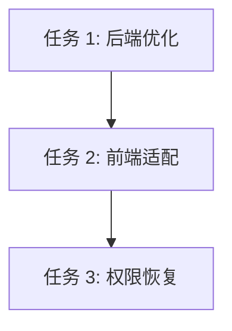

# TASK_VERSION_FIX

## 任务拆分

### 任务 1: 后端 SystemStatusService 优化
- **目标**: 扁平化数据库和后端服务的关键指标。
- **操作**:
  1. 修改 `evaluateBackendStatus`：确保 `metrics` 包含所有前端需要的字段。
  2. 修改 `evaluateDatabaseStatus`：从深层 `layers` 中提取 `maxConnections`, `cacheHitRate`, `slowQueries` 并放入 `metrics` 根部。
- **验收**: 使用 `Invoke-WebRequest` 验证 JSON 结构符合预期。

### 任务 2: 前端 Home.vue 适配与调试
- **目标**: 确保前端正确解析扁平化后的数据。
- **操作**:
  1. 检查 `refreshSystemStatusOverview` 中的赋值语句。
  2. 添加调试日志打印 `backendData` 和 `databaseData` 的完整结构。
  3. 修复任何导致版本号不显示的逻辑漏洞。
- **验收**: 页面正确显示版本号和数据库指标。

### 任务 3: 恢复权限中间件 (可选/后续)
- **目标**: 在测试完成后恢复接口的权限验证。
- **操作**: 将 `systemStatus.js` 中的 `authenticateToken, authorizeAdmin` 恢复。
- **验收**: 未登录访问报 401/403，登录后正常访问。

## 依赖关系图

