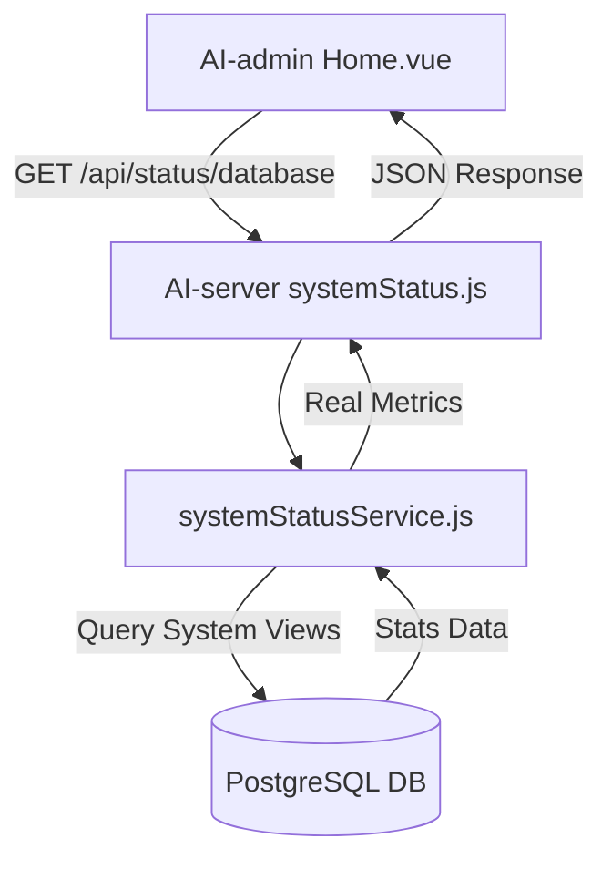

# DESIGN_数据库真实状态

## 整体架构图


## 分层设计和核心组件
- **数据层 (DB)**: 利用 PostgreSQL 内置的 `pg_stat_*` 视图。
- **服务层 (Service)**: `SystemStatusService` 类负责执行 SQL 并解析结果。
- **接口层 (Controller)**: `systemStatus.js` 封装响应。

## 核心查询逻辑设计
1. **当前连接数**:
   ```sql
   SELECT count(*) FROM pg_stat_activity WHERE state = 'active'
   ```
2. **最大连接数**:
   ```sql
   SHOW max_connections
   ```
3. **缓存命中率**:
   ```sql
   SELECT 
     ROUND(SUM(heap_blks_hit) * 100.0 / SUM(heap_blks_hit + heap_blks_read), 2) as hit_rate
   FROM pg_statio_user_tables
   ```
4. **慢查询数**:
   ```sql
   -- 尝试查询 pg_stat_statements
   SELECT count(*) FROM pg_stat_statements WHERE total_exec_time > 1000
   ```
5. **表空间使用**:
   ```sql
   SELECT pg_size_pretty(pg_database_size(current_database())) as db_size
   ```

## 异常处理策略
- 若 SQL 执行失败，记录错误日志并返回 `Unknown` 或 `0`。
- 针对 `pg_stat_statements` 缺失的情况，使用 `try-catch` 捕获异常并返回 0。

## 数据流向图
1. 前端触发刷新。
2. 后端并发执行多个 SQL 查询。
3. 后端将数值和格式化后的字符串组装进 `metrics` 对象。
4. 前端接收后更新 `databaseStats` 响应式对象。
