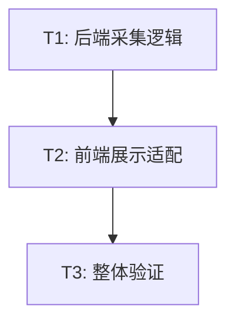

# TASK_数据库真实状态

## 原子任务拆分

### T1: 后端真实数据采集实现
- **输入契约**: 数据库连接池 `pool`。
- **输出契约**: 包含 `activeConnections`, `maxConnections`, `cacheHitRate`, `slowQueries`, `tableSpaceUsage` 的 `metrics` 对象。
- **实现约束**: 
  - 必须使用真实 SQL 查询。
  - 处理 `pg_stat_statements` 缺失的情况。
  - 格式化 `tableSpaceUsage` (如 "150 MB")。
- **验收标准**: 后端 API `/api/status/database` 返回真实数值。

### T2: 前端展示逻辑适配
- **输入契约**: 后端返回的 `metrics` 对象。
- **输出契约**: 首页仪表盘“数据库详情”展示真实数据。
- **实现约束**: 
  - 检查 Rule 5 处理双层嵌套结构。
  - 确保单位显示正确。
- **验收标准**: 页面显示数据与后端返回数据一致。

### T3: 整体验证
- **输入契约**: 已部署的后端和前端。
- **输出契约**: 验收测试通过记录。
- **验收标准**: 手动触发刷新，观察数据变化。

## 任务依赖图

